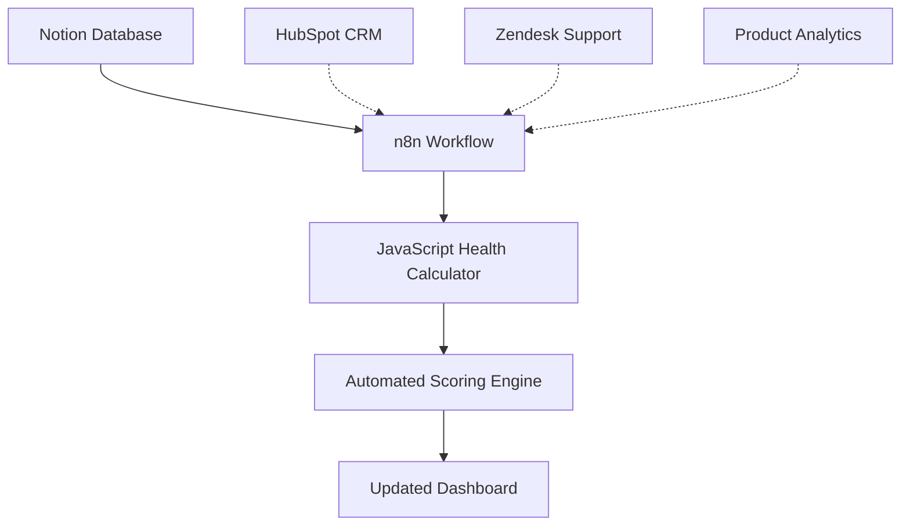

# 🎯 SaaS Customer Success Health Dashboard

**Automated Customer Health Scoring & Risk Assessment System**

*Built by a Customer Success Manager to solve the daily challenge of monitoring client health across multiple data sources.*

---

## 🚨 **The Challenge I Faced as a CSM**

As a SaaS Customer Success Manager, I was constantly juggling multiple tools and spreadsheets to get a complete picture of my clients' health:

- **📊 Product Analytics** - Feature adoption rates scattered across dashboards
- **🤝 CRM Data** - Meeting notes, renewal dates, relationship status buried in Salesforce/HubSpot
- **🎓 Learning Platforms** - Onboarding progress tracking in separate systems
- **💰 Revenue Data** - ARR figures in billing systems
- **🎫 Support Tickets** - Volume and severity data in Zendesk/Intercom
- **⏰ Manual Scoring** - Spending hours each week manually calculating health scores

**The Result:** Critical client issues were slipping through the cracks because I couldn't efficiently monitor 50+ accounts across 5+ different systems.

---

## 💡 **The Solution: Automated Health Dashboard**

I built an intelligent Customer Success Dashboard that:

✅ **Automatically calculates health scores** using weighted algorithms  
✅ **Consolidates data** from multiple sources into one view  
✅ **Identifies at-risk accounts** before they churn  
✅ **Flags expansion opportunities** based on engagement + adoption  
✅ **Runs weekly** to keep data fresh without manual work  
✅ **Provides actionable insights** with clear red/yellow/green indicators  

### 🎯 **Business Impact**
- **⏱️ 10+ hours saved weekly** on manual health score calculations
- **🔍 100% account visibility** - no more blind spots
- **📈 Earlier risk detection** - identify issues 60-90 days before renewal
- **💼 Expansion identification** - spot upsell opportunities automatically
- **📊 Data-driven decisions** - replace gut feelings with concrete metrics

---

## 🏗️ **Technical Architecture**



**Core Components:**
- **🗄️ Notion Database** - Centralized data storage and beautiful dashboard
- **⚡ n8n Workflow** - Automation engine (runs weekly)
- **🧮 JavaScript Calculator** - Custom health scoring algorithm
- **📈 Real-time Dashboard** - Visual health indicators and alerts

---

## 📊 **Health Scoring Algorithm**

### **Overall Health Score (0-100)**
Weighted calculation based on three key metrics:

| **Metric** | **Weight** | **Scoring Logic** |
|------------|------------|-------------------|
| **Engagement Status** | 40% | Highly Engaged: 90pts, Engaged: 70pts, Passive: 40pts, Disengaged: 20pts |
| **Feature Adoption** | 40% | Direct score (0-100) from product analytics |
| **Support Health** | 20% | ≤2 tickets: 100pts, 3-5: 80pts, 6-10: 60pts, >10: 30pts |

### **Health Status Categories**
- **🟢 Healthy** - 75+ points
- **🟡 At Risk** - 50-74 points  
- **🔴 Critical** - <50 points

### **Automated Flags**
- **✅ Expansion Ready** - High adoption + engagement + low support volume
- **⚠️ Needs Attention** - Multiple risk factors present
- **🚨 Renewal Risk** - Poor health + approaching renewal date

---

## 🚀 **Quick Start Guide**

### **Prerequisites**
- Notion account (free tier works)
- n8n account (free tier: 5,000 executions/month)
- 30 minutes setup time

### **Step 1: Set Up Notion Database**
1. **Import the database template** → [`notion-dashboard-import-template.md`](./notion-dashboard-import-template.md)
2. **Add your client data** to the required columns
3. **Copy your database ID** from the URL

### **Step 2: Configure n8n Workflow**
1. **Import workflow** → [`weekly-notion-scoring-workflow.json`](./weekly-notion-scoring-workflow.json)
2. **Add Notion credentials** in n8n
3. **Update database ID** in the workflow
4. **Test the connection**

### **Step 3: Deploy JavaScript Calculator**
1. **Copy the scoring code** → [`final-javascript-scoring.js`](./final-javascript-scoring.js)
2. **Paste into n8n Code node**
3. **Verify column name mappings**
4. **Test with sample data**

### **Step 4: Schedule & Monitor**
1. **Set weekly schedule** (recommended: Monday mornings)
2. **Test full workflow execution**
3. **Monitor your dashboard** for updated scores

**🎉 Total setup time: ~30 minutes**

---

## 📁 **Project Structure**

```
Dashboard-n8n/
├── README.md                              # This file - project overview
├── final-javascript-scoring.js           # Core health scoring algorithm
├── weekly-notion-scoring-workflow.json   # n8n workflow configuration
├── notion-dashboard-import-template.md   # Notion database setup template
├── beginner-notion-n8n-setup.md         # Detailed setup walkthrough
├── field-population-guide.md            # Data mapping reference
└── comprehensive-api-scoring-workflow.json # Advanced multi-API version
```

---

## 🎨 **Dashboard Preview**

### **📊 Portfolio Health Overview**


**Key Features:**
- **🎯 Health Status Grouping** - Instantly see At Risk (2), Critical (0), and Healthy (1) accounts
- **📈 Visual Health Scores** - Progress bars show exact scores (TechCorp: 90, RetailMax: 74, StartupXYZ: 68)
- **🚨 Smart Flags** - Automated indicators for Renewal Risk, Expansion Ready, and Needs Attention
- **💰 ARR Visibility** - Revenue impact at a glance ($5,000, $1,500, $2,500)
- **📅 Renewal Dates** - Timeline awareness for proactive planning

### **⚡ n8n Automation Workflow**


**Automation Pipeline:**
1. **🕘 Weekly Monday 9AM Trigger** - Runs automatically every week
2. **📥 Get All Client Data** - Pulls fresh data from Notion database (4 items processed)
3. **🧮 Calculate All Health Scores** - JavaScript processes engagement, adoption, and support metrics (3 items calculated)
4. **📤 Update Client Health Scores** - Writes calculated scores back to Notion (3 items updated)

### **🎯 Expansion Pipeline View**


**Expansion Identification:**
- **✅ TechCorp Solutions** - Flagged as Expansion Ready with 85 Feature Adoption Score
- **📊 Feature Usage** - Shows Feature 1, Feature 2, Feature 3 adoption
- **📈 Health Score** - 90 points indicates strong relationship + product value
- **📅 Renewal Timeline** - March 8, 2026 gives time for expansion conversations

### **📅 Renewal Calendar View**


**Proactive Renewal Management:**
- **📍 Visual Timeline** - September 24th highlighted for immediate attention
- **🎯 Strategic Planning** - See all renewals at a glance for resource allocation
- **⏰ Early Warning System** - Plan outreach 60-90 days before renewal dates

### **📋 Complete Client Database**


**Comprehensive View:**
- **👥 All Client Data** - TechCorp (90→Healthy), StartupXYZ (68→At Risk), RetailMax (74→At Risk)
- **🎯 Engagement Status** - Highly Engaged, Engaged levels clearly visible
- **📊 Feature Adoption** - 85, 50, 65 scores show usage depth
- **💰 ARR Tracking** - $5,000, $2,500, $1,500 revenue visibility
- **📞 Last Contact** - 17, 10, 32 days for relationship management

---

## ⚙️ **Customization Options**

### **Adjust Scoring Weights**
Modify the algorithm in [`final-javascript-scoring.js`](./final-javascript-scoring.js):
```javascript
// Current weights: Engagement 40%, Adoption 40%, Support 20%
const overallHealthScore = Math.round(
  (engagementScore * 0.40) +     // Adjust this weight
  (adoptionScore * 0.40) +       // Adjust this weight  
  (supportHealthScore * 0.20)    // Adjust this weight
);
```

### **Add New Data Sources**
Use [`comprehensive-api-scoring-workflow.json`](./comprehensive-api-scoring-workflow.json) to integrate:
- HubSpot CRM data
- Zendesk support tickets
- Product analytics APIs
- Custom data sources

### **Modify Risk Thresholds**
Update the health status boundaries:
```javascript
// Customize these thresholds based on your business
if (overallHealthScore >= 75) healthStatus = 'Healthy';        // Adjust threshold
else if (overallHealthScore >= 50) healthStatus = 'At Risk';   // Adjust threshold
else healthStatus = 'Critical';
```

---

## 🔧 **Troubleshooting**

### **Common Issues & Solutions**

**❌ "Could not find database" error**
- ✅ Verify database ID format (no hyphens)
- ✅ Check Notion integration permissions
- ✅ Ensure database is shared with integration

**❌ JavaScript returns no data**
- ✅ Verify column names match exactly (case-sensitive)
- ✅ Check if Engagement Status is multi-select vs select
- ✅ Confirm Simplify setting in Notion nodes

**❌ Health scores seem wrong**
- ✅ Review debug output in JavaScript node
- ✅ Verify data types in Notion (Number, Select, Checkbox)
- ✅ Check scoring algorithm weights

**📖 Full troubleshooting guide:** [`beginner-notion-n8n-setup.md`](./beginner-notion-n8n-setup.md)

---

## 🚀 **Advanced Features**

### **Multi-API Integration**
Automatically pull data from:
- **HubSpot** - Contact properties, deal stages, meeting notes
- **Zendesk** - Ticket volume, satisfaction scores, resolution times  
- **Product Analytics** - Feature usage, session data, user journeys
- **Billing Systems** - ARR, payment history, subscription changes

### **Smart Alerts**
- **📧 Email notifications** for critical health drops
- **📱 Slack integration** for renewal risk alerts
- **📊 Weekly summary reports** for management

### **Predictive Analytics**
- **🔮 Churn probability** based on historical patterns
- **📈 Expansion likelihood** scoring
- **📅 Optimal outreach timing** recommendations

---

## 🤝 **Contributing**

This solution was built by a CSM for CSMs. Contributions welcome!

### **How to Contribute**
1. **Fork the repository**
2. **Create feature branch** (`git checkout -b feature/improvement`)
3. **Test your changes** with real customer data
4. **Submit pull request** with clear description

### **Contribution Ideas**
- Additional data source integrations
- Enhanced scoring algorithms  
- Dashboard UI improvements
- Mobile-friendly views
- Advanced analytics features

---

## 📄 **License**

MIT License - Feel free to use this in your organization and modify as needed.

---

## 📞 **Questions & Support**

**Built by:** [Your Name] - SaaS Customer Success Manager  
**LinkedIn:** [Your LinkedIn]  
**Email:** [Your Email]  

### **Get Help**
- 🐛 **Bug Reports** - Create an issue with detailed description
- 💡 **Feature Requests** - Open discussion with use case details  
- 🤝 **Setup Help** - Comment on setup guide with specific questions
- 💬 **CSM Community** - Share your customizations and results!

---

*⭐ If this solution helped you save time and improve your customer success operations, please star the repo and share with other CSMs!*